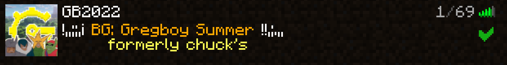
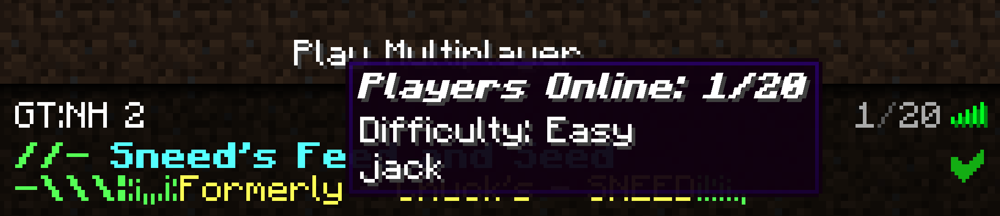
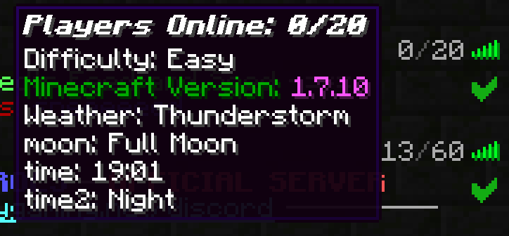

# Custom MOTD

## Description

A 1.7.10 Forge server-side mod to customize your server MOTD and player list!

 

## Downloads
* [CurseForge ](https://www.curseforge.com/minecraft/mc-mods/custom-motd)
* [Modrinth ](https://modrinth.com/mod/custom-motd-1.7)
* [Git ](https://github.com/JackOfNoneTrades/CustomMOTD/releases)

## Dependencies

* As of version `1.0.1`, `UniMixins` (, , ) is a required dependency.

### Features
* Vanilla Compatible
* Customizable Random MOTDs
* Customizable `PlayerList` tooltip

### New Features
* Mod is fully server-side
* `{playerlist}` variable backport, `{weather}`, `{time}`, `{time_of_the_day}`
* Configurable server info update and hot reload intervals
* Config reload command `/cmotd_reload`
* `TabFaces` (, , ) compat
* Modded compat variables

On first run, the mod will generate the two required files for MOTD customization in <server root dir>/CustomMOTD
There are 2 files used for configuration:
* `customotdlist.txt`

This mod supports multiline MOTDs (2 lines as per vanilla). To set a new line, use the pipe | character in the entry in `custommotdlist.txt`
Each entry in `custommotdlist.txt` is a separate MOTD entry.

* `customplayerlist.txt`
Contains the replacement template for the player list tooltip.

### Variables
* `{playercount}` - number of players currently on the server
* `{maxplayers}` - maximum number of players the server supports
* `{difficulty}` - server difficulty level
* `{mcversion}` - server Minecraft version
* `{radio}` - obfuscated radio bars
* `{playerlist}` - list up to 10 players currently online
* `{weather}` - displays weather, formatting is configurable
* `{time}` - displays time, formatting is configurable
* `{time_of_the_day}` - displays the time of the day (e.g. Noon, Midnight)

### Modded Variables
* `{rt_bloodmoon}` - Random Things Blood Moon, formatting is configurable
* <del>`{serene_season}` - Serene Seasons season </del> For now the `1.7.10` port of Serene Seasons is broken
* `{lycanites_event}` - Active Lycanites Mobs event in the overworld, formatting is configurable
* TerraFirmaCraft - Various vars: `{tfc_season}`, `{tfc_day_of_month}`,`{tfc_day_of_week}`,`{tfc_day_of_year}`,`{tfc_month}`,`{tfc_month_name}`,`{tfc_year}`,`{tfc_hour}`,`{tfc_temperature}`

Feel free to reach out to me to propose new modded variables.

### Color Codes and Formatting
Full support for default Minecraft color codes and formatting using `&`.

You can comment out a line by prefixing it with `#`.
Special characters `|` and `&`, as well as leading `#` can be escaped with a backslash (`\`).

## Credits
This mod is based on `p455w0rd's MOTD Customizer` ().

## License

`LgplV3 + SNEED`.

 

